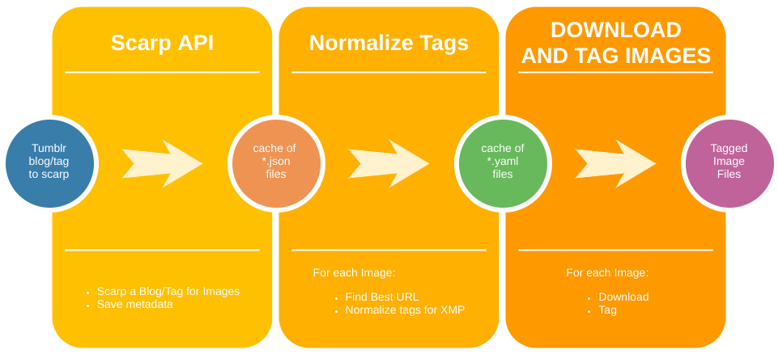
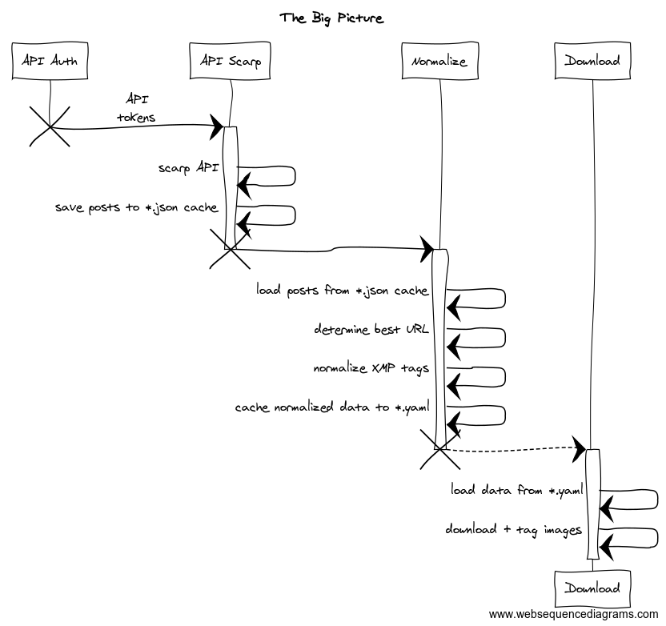

# TumblrScarper

Scarp, download, and intelligently tag images from Tumblr blogs

<!-- vim-markdown-toc GFM -->
* [Description](#description)
* [Installation](#installation)
* [Usage](#usage)
* [Reference](#reference)
  * [Sequence](#sequence)
  * [Details](#details)
* [Development](#development)
* [Contributing](#contributing)
* [Code of Conduct](#code-of-conduct)

<!-- vim-markdown-toc -->


## Description

Tumblr scarping takes place in three stages:



The artifacts from each stage is cached, so every stage can be interrupted/resumed without needing to re-run the previous stage.

[1]: https://www.sno.phy.queensu.ca/~phil/exiftool/

## Installation

Add this line to your application's Gemfile:

```ruby
gem 'tumblr_scarper'
```

And then execute:

    $ bundle

Or install it yourself as:

    $ gem install tumblr_scarper

## Usage

    # Step 1: Scarp
    #   - Query Tumblr API for the blog's post data, cache it local *.json files
    #   - Caches data to: `BLOGNAME/offset-###.json`
    $ bundle exec bin/tumblr_scarper scarp BLOGNAME

    # Step 2: Normalize tags
    #   - Compiles the cached post data into a single file
    #   - Determines (best) image URL, local filename, metadata to use in tags
    #   - Any data sanitization happens here (tag subs, etc)
    #   - Resulting file: `BLOGNAME/url-tags-downloads.yaml`
    #   - Skipped (unusable) posts in file: `BLOGNAME/_skipped__answer.yaml`
    $ bundle exec bin/tumblr_scarper normalize BLOGNAME

    # Step 3: Download the posts!
    #   - Downloads images
    #   - Tags local files
    #   - Copies files to: `BLOGNAME/downloaded_files`
    #   - Everything is driven by the data in `BLOGNAME/url-tags-downloads.yaml`
    $ bundle exec bin/tumblr_scarper download BLOGNAME

## Reference

### Sequence



### Details

1. **Scarp**
  - Fetches post data from Tumblr API
    - Saves to a local cache of `*.json` files
    - paginates API data into paginated .json files
  - Idempotent: cached API data is not queried on subsequent runs

2. **Normalize** post metadata for each image, cache results to `*.yaml` files on disk
  - Uses `*.json` files cached during Scarp in stage 1
  For each image:
    1. Determine best image URL to download
    2. Normalize tags into XMP-ready taxonomy
      1. Fix up any problem tags (substitution, remove)
    3. Determine best local filename for image

3. **Download + Tag** image files
  - Uses `*.yaml` file(s) created/cached during stage 2
  - For each image:
    1. Download image file
    2. Tag image file with XMP tags based on the post metadata
      * uses [ExiftTool][1]
      * post metadata = tags


## Development

After checking out the repo, run `bin/setup` to install dependencies. Then, run `rake spec` to run the tests. You can also run `bin/console` for an interactive prompt that will allow you to experiment.

To install this gem onto your local machine, run `bundle exec rake install`. To release a new version, update the version number in `version.rb`, and then run `bundle exec rake release`, which will create a git tag for the version, push git commits and tags, and push the `.gem` file to [rubygems.org](https://rubygems.org).

## Contributing

Bug reports and pull requests are welcome on GitHub at https://github.com/trash-panda/tumblr_scarper. This project is intended to be a safe, welcoming space for collaboration, and contributors are expected to adhere to the [Contributor Covenant](http://contributor-covenant.org) code of conduct.

## Code of Conduct

Everyone interacting in the TumblrScarper project’s codebases, issue trackers, chat rooms and mailing lists is expected to follow the [code of conduct](https://github.com/trash-panda/tumblr_scarper/blob/master/CODE_OF_CONDUCT.md).
